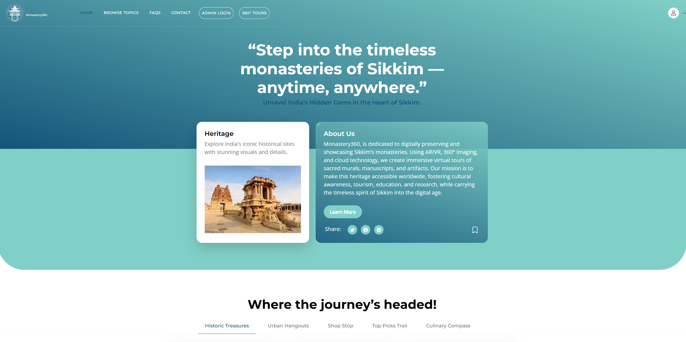
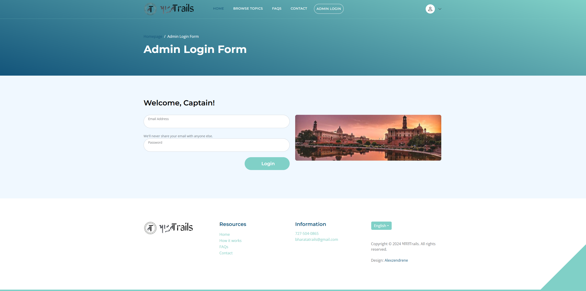
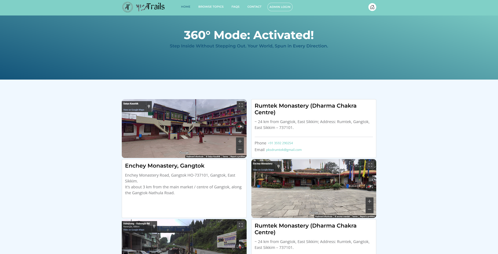
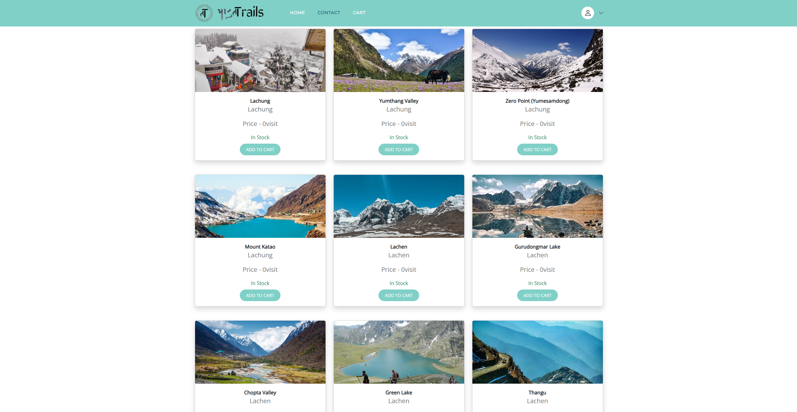

## Monasteries360
A comprehensive web application showcasing the monasteries of Sikkim, India with interactive features including a ticket booking system and immersive 360° views powered by Google Maps API. Inspired by rich cultural heritage of Sikkim’s monasteries.

## Features
- Browse and explore detailed information about monasteries in Sikkim.

- User registration, login, and profile management.

- Admin panel for managing monasteries, states, and orders.

- Interactive 360° views of monasteries.

- Ticket booking system with order history and confirmation pages.

- Responsive, user-friendly UI built with Bootstrap and custom JavaScript.

- Interactive maps and place viewing features.

- Contact form and general site navigation pages.

## Project Structure Overview

- **Backend**: Flask-based Python application serving dynamic web pages.

- **Templates**: HTML pages rendered via Jinja2 templates for user and admin interfaces.

- **Static assets**: CSS stylesheets, JavaScript files, fonts, and images supporting the frontend.

- **Screenshots**: Images demonstrating the UI for home, login, admin dashboard, 360° view, and booking pages.

## Usage Overview

- Users can register, log in, browse monastery details, explore immersive 360° views, book tickets, and manage their profiles.

- Admins can log in to manage monastery listings, states, ticket orders, and view summary dashboards.

- Interactive maps and 360° virtual tours enhance the user experience.

- The ticket booking system allows users to select and purchase monastery visit tickets securely.

## Technologies Used

- Python 3 with Flask for backend development.

- HTML, CSS, JavaScript (including jQuery and Bootstrap) for frontend design.

- Google Maps API integration for maps and immersive 360° views.

- Jinja2 templating engine for rendering dynamic pages.

## Screenshots

### Homepage

### Admin Login Page

### 360° View Mode

### User View Page

